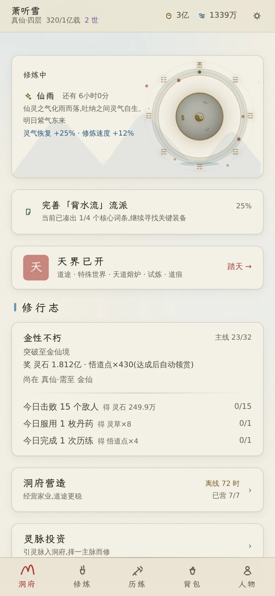
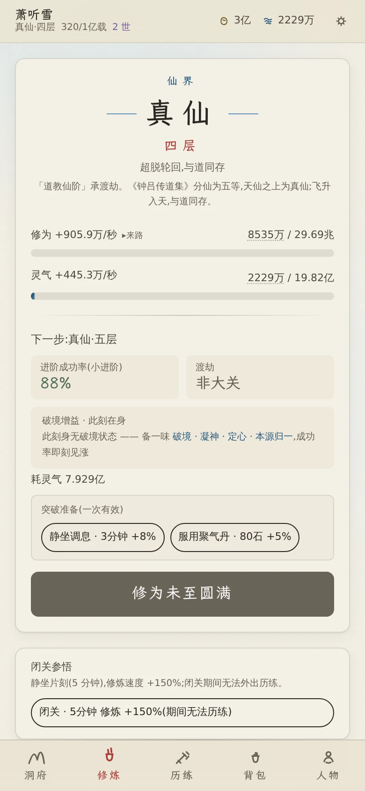
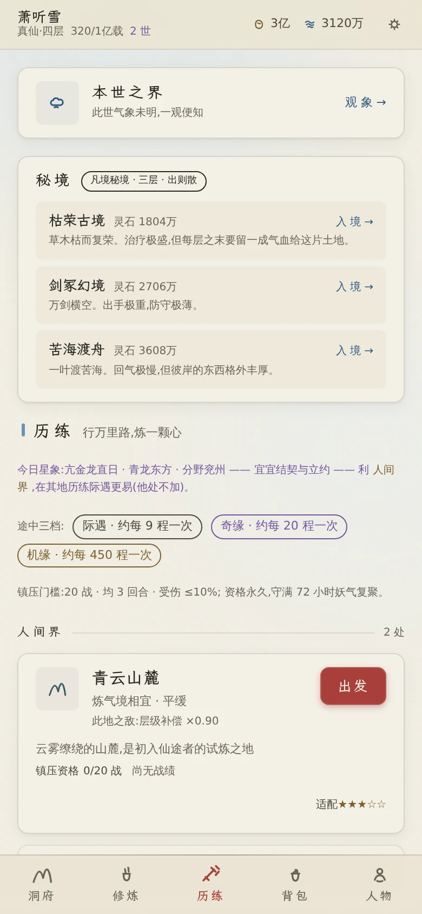
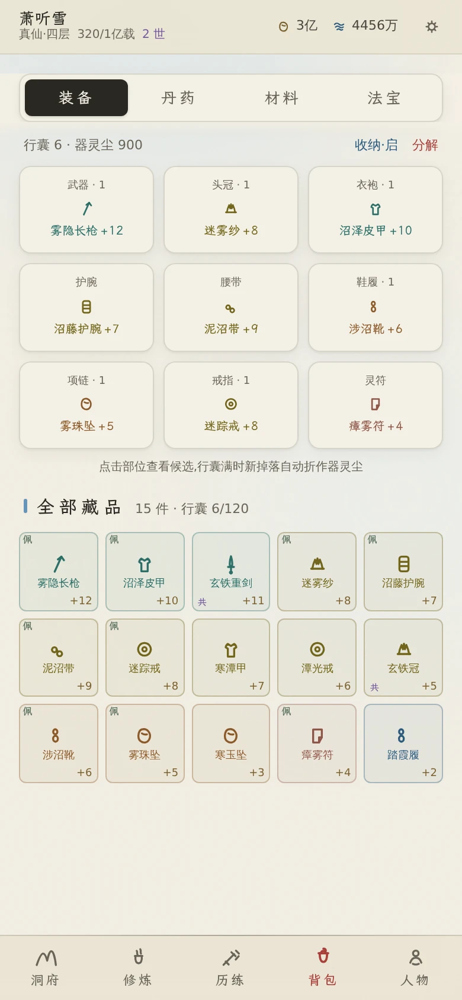
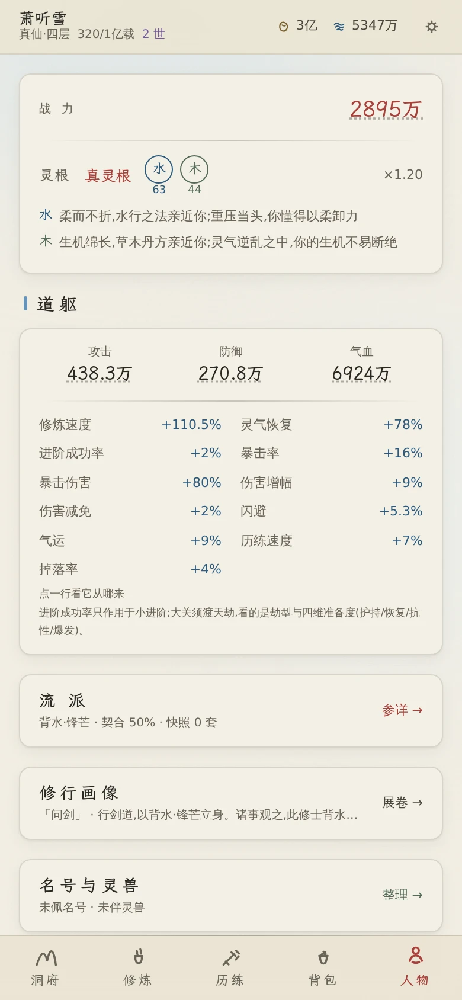
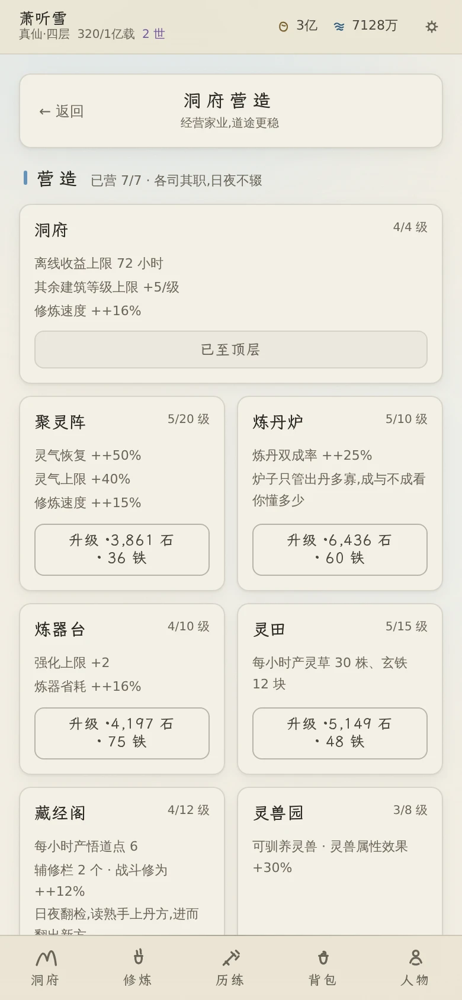
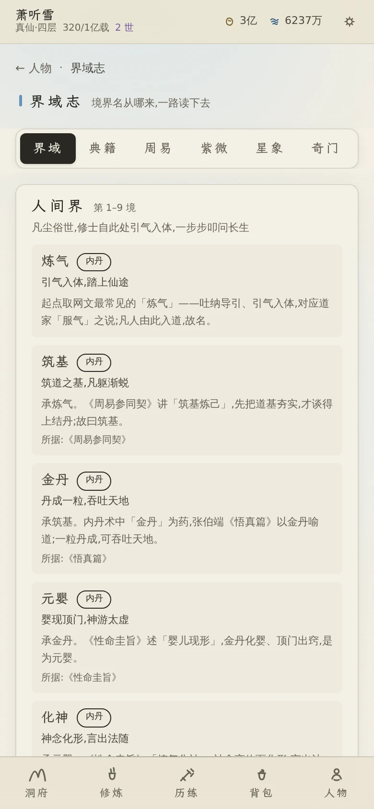
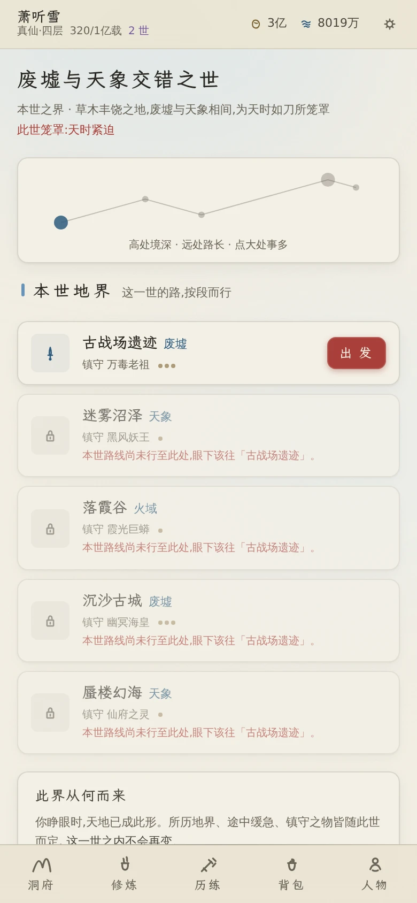
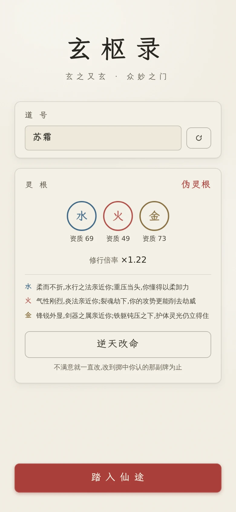
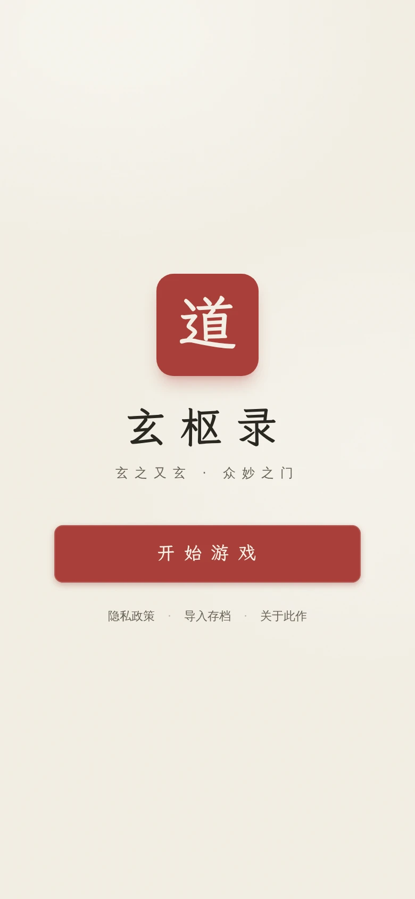

<div align="center">
  

  **玄之又玄 · 众妙之门**

  一款文字版修仙放置游戏 —— 水墨国风,四界二十一境,
  后台预解算的回合制战斗,断网也能接着修。

  [](https://github.com/pplmx/xian/releases/latest)
  [](https://github.com/pplmx/xian/actions/workflows/deploy.yml)
  [](https://opensource.org/licenses/MIT)
</div>

## 这是什么

从凡人引气入体开始,一路修到混沌道祖 —— **四界二十一境**,每境九层至圆满,突破要渡劫。
历练是派遣式的:派出去、等一段时间、回来看遭遇与掉落;战斗在后台一次算完再回放,
所以**关掉页面、断网、隔一晚再回来**,该发生的事一件不少。

三条贯穿全程的取向:

- **离线是常态,不是补丁** —— 挂机收益、自动挑战、读档补票都按"玩家可能一周没上线"设计;
- **后台算完再回放** —— 在线逐场预解算;离线普通战按取样胜率做期望结算、首领战走同一份预解算。规则与公式同源,不会离线另起一套口径;
- **规则与数值分开** —— 四套数值系统已抽成独立内核(见[万象引擎](#公共库万象引擎)),本作只写内容。

玩法规模、系统一览与设计取向见 **[docs/usage.md](docs/usage.md)**。

## 界面一览

> 手机竖屏(390×844)。图由 `bun run shots` 从当前构建生成(存档是一份真仙期展品档)——
> 改完界面重跑一次即可换新,不必手工截图。

| 首页 | 修行 | 历练 | 背包 |
| :-: | :-: | :-: | :-: |
|  |  |  |  |
| 天时 · 修行志 · 入口 | 闭关 · 突破 · 渡劫 | 秘境 · 地界 · 镇压 | 装备 · 丹药 · 法宝 |

| 人物 | 洞府 | 界域志 | 本世之界 |
| :-: | :-: | :-: | :-: |
|  |  |  |  |
| 属性 · 流派 · 名号 | 营造 · 灵脉 · 灵兽 | 境界与典籍的来处 | 世界节律 · 地界 |

| 建号 | 踏入 |
| :-: | :-: |
|  |  |
| 道号与灵根鉴定 | 开局一屏 |

## 快速开始

需要 [Bun](https://bun.sh) 1.4.2(与 `package.json` 的 `packageManager` 一致)。

```bash
vp install      # 安装依赖(底层走 bun)
vp dev          # 开发服务器
vp build        # 类型检查 + 生产构建
vp preview      # 预览构建结果
vp test         # 全量用例(333 spec / 3151 例,本作 253 / 2556)
vp check        # 环境/类型/文档自检 + Oxlint
```

> 统一以 Vite+(`vp`)为入口:`dev/build/preview/test/lint/fmt/check` 都经它跑;
> `bun dev` / `bun preview` / `bun run test` 这些只是薄封装,最终都落到 `vp`。
> ESLint 已迁移为 Oxlint(`vp lint`),Vitest 5 由 `vp test` 托管。
> 依赖安装与锁文件仍走 bun(`vp install` 底层也是 bun),见下方「运行时策略」。

## 运行时策略

这个仓库里 **Bun、Node、浏览器各管一段,不打架**:

| 角色 | 谁来当 | 承担的事 |
| --- | --- | --- |
| 包管理器 + 脚本执行器 | **Bun** 1.4.2 | 装依赖、锁文件(`bun.lock`)、跑 `package.json` 脚本。`packageManager: bun@1.4.2` 明确的正是这一层 |
| 工具链兼容基准 | **Node** ≥ 22.18 | `engines.node` 表达的是"跑 Vue/Vite/vue-tsc/Oxlint 这条工具链至少要 Node 22.18",**不是**「应用跑在 Node 上」 |
| 生产运行时 | **浏览器** | Web / PWA 的最终宿主,应用代码在这里跑 |
| 平台运行时 | **Electron / Capacitor** | 把同一份 Web 产物包进 Windows 桌面与 Android 的壳 |

`engines.node >= 22.18` 与 `packageManager: bun@1.4.2` 并存**不矛盾**:前者声明
「工具链需要多新的 Node」(通常是 CI / Docker 的基础镜像),后者声明
「安装与脚本托管交给 Bun」。两者约束的是不同层次 —— 只要包管理走 Bun、
工具链跑在 ≥22.18 的 Node 上即可,两个字段描述的是同一套开发环境的两半。

## 文档

| 文档 | 内容 |
| --- | --- |
| [docs/usage.md](docs/usage.md) | **怎么玩**:开局、日常循环、玩法与系统一览、数值口径 |
| [docs/development.md](docs/development.md) | **怎么改**:环境、命令、测试与判据、项目结构、发版流程 |
| [docs/deployment.md](docs/deployment.md) | **怎么部署**:Web / PWA、Android、Windows 桌面、Docker 与反向代理 |
| [docs/engine.md](docs/engine.md) | 与公共库(万象引擎)的关系、已迁移系统与逐数字对账清单 |
| [docs/design.md](docs/design.md) | 配色、版式、字体子集、动效与无障碍 |

## 公共库:万象引擎

等级(境界)、属性、装备、副本四套系统已经从本作里**抽成独立内核** —— 不依赖 Vue / Pinia / 浏览器 API,
换一套名称与内容就能搭出自己的游戏。独立仓库与文档:
<https://github.com/pplmx/wanxiang-engine>(版本 `v0.1.22`)。

```jsonc
// 别人引用它的方式:装发布版压缩包(包里带编译好的 dist,不需要任何构建脚本)
"wanxiang-engine": "https://github.com/pplmx/wanxiang-engine/releases/download/v0.1.22/wanxiang-engine-0.1.22.tgz"
// 不要写成 github:pplmx/wanxiang-engine#vX.Y.Z —— 那条路依赖 prepare 现场编译,
// bun 默认拦掉安装脚本、放行后又缺 devDependencies(tsc 不存在);原因与实测见库的 docs/development.md
```

本作自己也只是一个使用者:源码里写的是 `from 'wanxiang-engine'`,开发期由 Vite / TS 的解析配置
指向 `packages/engine`;`bun run check:engine` 会守住"只经公开入口引用、别名不许复活"这条。
两个仓库之间用 `git subtree` 同步(选一处开发,别两边同时改),细节见
[docs/engine.md](docs/engine.md)。

## 技术栈

| 技术 | 版本 | 用途 |
| --- | --- | --- |
| Vue 3 | 3.5 | 组合式 API + `<script setup>` |
| TypeScript | 6.0 | strict 严格类型检查 |
| Vite | 8 | 构建与开发服务器 |
| Pinia | 3 | 状态管理(18 个 store,除瞬态 `ui` 外 17 个自动持久化) |
| Tailwind CSS | 3.4 | 水墨色系语义色与暗色主题 |
| Vue Router | 4 | 客户端路由(hash 模式) |
| Tone.js | 15 | FluidR3 乐器采样播放(BGM + SFX) |
| CryptoJS | 4 | 存档 AES 加密 |
| Vitest | 5 | 单元测试与平衡审计(全量 333 个 spec / 3151 例,含公共库 `packages/engine` 的 80 / 595) |
| Electron / Capacitor | 39 / 8 | Windows 桌面与 Android 打包 |

## 许可证

本项目采用 [MIT](https://opensource.org/licenses/MIT) 许可协议:可以自由使用、修改、分发,
商用也可以,只需保留版权声明与许可文本。详见 [LICENSE](LICENSE)。

**第三方资源**:内置的楷体子集取自 [霞鹜文楷 LXGW WenKai](https://github.com/lxgw/LxgwWenKai),
按 SIL OFL 1.1 分发(协议全文随产物一起放在 `public/fonts/OFL.txt`)。它的授权与本项目的
MIT 各自独立 —— 再分发字体时请保留其协议文本与保留字体名。
